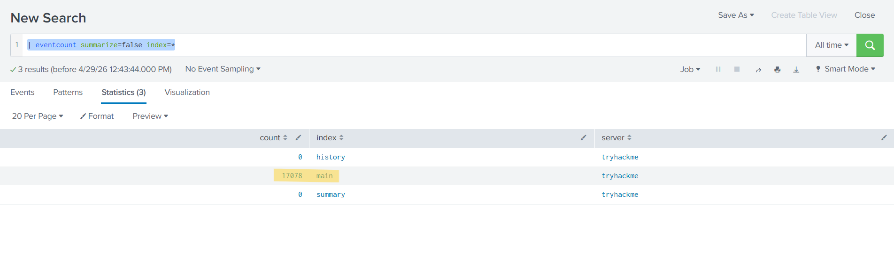
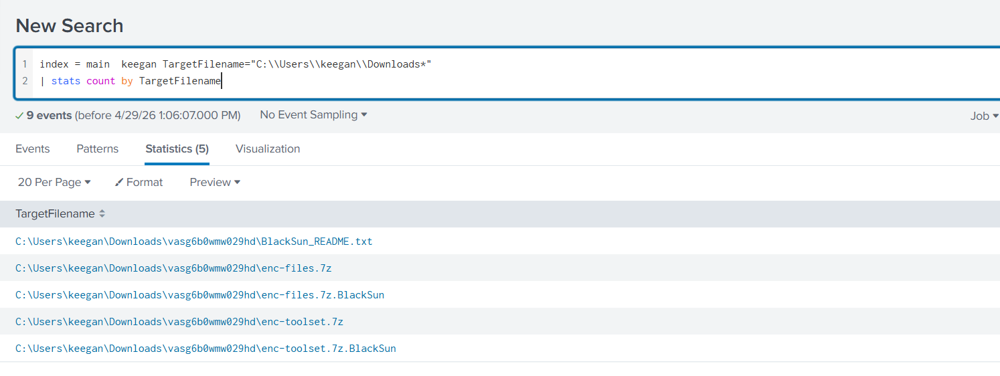
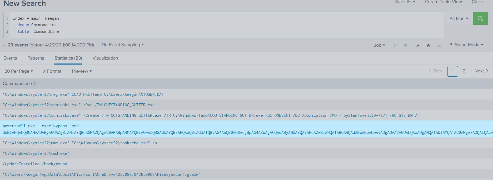
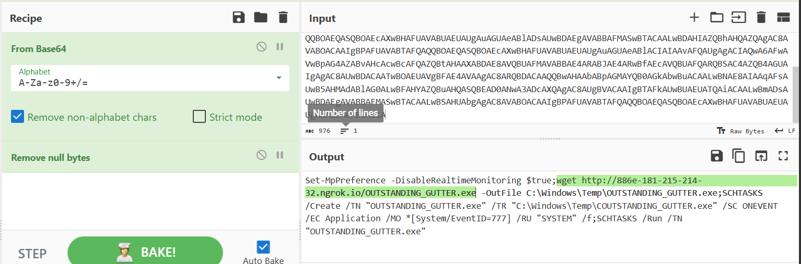
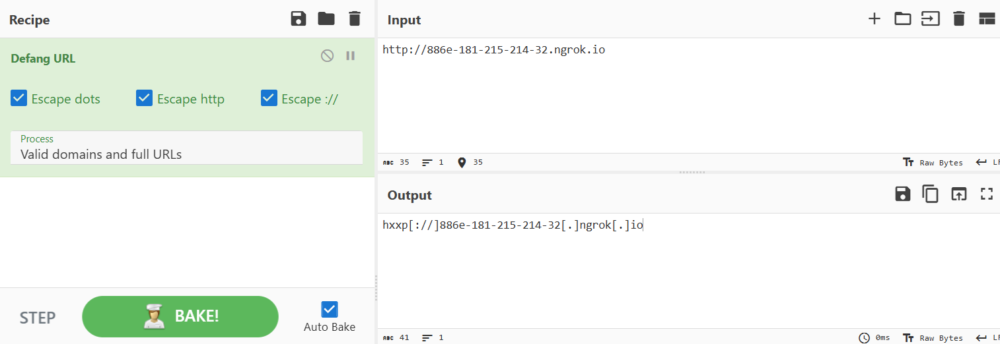
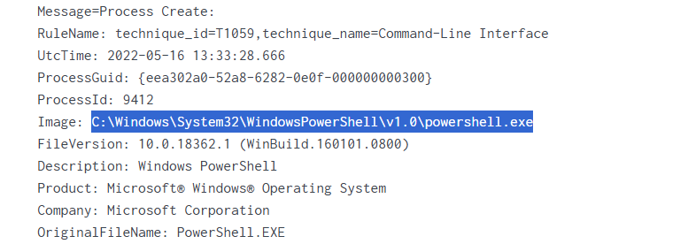
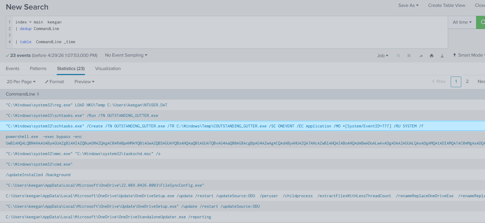

# PS Eclipse
### Lab Link [PS Eclipse](https://tryhackme.com/room/posheclipse)

## Scenario
```
You are a SOC Analyst for an MSSP (Managed Security Service Provider) company called TryNotHackMe .

A customer sent an email asking for an analyst to investigate the events that occurred on Keegan's machine on Monday, May 16th, 2022 . The client noted that the machine is operational, but some files have a weird file extension. The client is worried that there was a ransomware attempt on Keegan's device. 

Your manager has tasked you to check the events in Splunk to determine what occurred in Keegan's device.
Happy Hunting!
```

### Q1: A suspicious binary was downloaded to the endpoint. What was the name of the binary?

Firstly, use this command to know indexes 
 - | eventcount summarize=false index=*

   

Data is only available in the main index.

At first, I searched using the file path to see what was downloaded in the Downloads folder, 
but I didn’t find anything. Then I searched for files downloaded using PowerShell.



 - index = main  keegan | dedup CommandLine | table  CommandLine



I found that command which means ExecutionPolicy Bypass and EncodedCommand so I went to [Cyber Chef](https://cyberchef.org/)



Answer: `OUTSTANDING_GUTTER.exe`


### Q2: What is the address the binary was downloaded from? Add http:// to your answer & defang the URL.

the answer is in the photo above 

to defang the url, you can use CyberChef too. 




Answer: `hxxp[://]886e-181-215-214-32[.]ngrok[.]io`


### Q3: What Windows executable was used to download the suspicious binary? Enter full path.

from the photo that include the powershell commands, click view events 




Answer: `C:\Windows\System32\WindowsPowerShell\v1.0\powershell.exe`


### Q4: What command was executed to configure the suspicious binary to run with elevated privileges?

Using the same command above, it can be observed that the attacker created a scheduled task to run the malicious executable as SYSTEM.



Answer: `"C:\Windows\system32\schtasks.exe" /Create /TN OUTSTANDING_GUTTER.exe /TR C:\Windows\Temp\COUTSTANDING_GUTTER.exe /SC ONEVENT /EC Application /MO *[System/EventID=777] /RU SYSTEM /f`


   
