# Splunk 2 aka Boss of the SOC writeup 
### lab Link [Splunk 2](https://tryhackme.com/room/splunk2gcd5)
# 100 series questions
## scenario 
### Question 1: Identify the competitor website

The objective is to determine the competitor website visited by Amber by analyzing network traffic logs.

### Step 1: Identify Amber's IP address

 we focus on PAN traffic logs to extract her IP address:

- index="botsv2" sourcetype="pan:traffic" amber

you will find the  `src_ip: 10.0.2.101`

### Step 2: Analyze HTTP traffic

After identifying Amber's IP address, we analyze her web activity:

- index="botsv2" IPADDR sourcetype="stream:HTTP"

you can navigate to  `http_referrer` to see all visited websites 

### Step 3: Extract visited websites

To narrow down the results and focus on websites:

- index="botsv2" IPADDR sourcetype="stream:HTTP" |dedup site |table site

 

### Q1: Amber Turing was hoping for Frothly to be acquired by a potential competitor which fell through, but visited their website to find contact information for their executive team. What is the website domain that she visited?

Through a Google search, I found that Frothly is a brewing supplies company.

The domain `www.berkbeer.com` was identified as the competitor website, as it belongs to the same industry (beer/beverage) as Frothly.

Answer: `www.berkbeer.com`

### Question 2-7 

After identifying the competitor website, we focused on Amber’s HTTP traffic to that domain:

- index="botsv2" IPADDR sourcetype="stream:HTTP" COMPETITOR_WEBSITE

This helped identify the image accessed by Amber.

Next, we analyzed SMTP traffic to retrieve Amber’s email address and investigate communication with the competitor:

- index="botsv2" sourcetype="stream:smtp" AMBERS_EMAIL COMPETITOR_WEBSITE

This allowed us to identify email exchanges and extract additional details such as the CEO’s full name.

### Q2: Amber found the executive contact information and sent him an email. What image file displayed the executive's contact information? Answer example: /path/image.ext

you can you this query 
- index="botsv2" 10.0.2.101 sourcetype="stream:HTTP" "www.berkbeer.com" 
| table uri_path 
| dedup uri_path

 

Answer: `/images/ceoberk.png`

### Q3: What is the CEO's name? Provide the first and last name.

by using this query 
- index="botsv2" smtp
                    
by the way, SMTP protocol is Simple Mail Transfer Protocol which is related to mails 
  you will find amber mail `aturing@froth.ly`
  
use this - index="botsv2" smtp  "aturing@froth.ly" ceo
then click `show as raw text` to show all info 

Answer: `Martin Berk`

### Q4: What is the CEO's email address?

with the same query above you can find sender_email: "mberk@berkbeer.com"

Answer: `mberk@berkbeer.com`

### Q5: After the initial contact with the CEO, Amber contacted another employee at this competitor. What is that employee's email address?
- index="botsv2" smtp  aturing@froth.ly berkbeer
  
you will find another email address from the same company
  
  
  
  Answer : `hbernhard@berkbeer.com`

### Q6: What is the name of the file attachment that Amber sent to a contact at the competitor?
- index="botsv2" smtp  "aturing@froth.ly" berkbeer

Answer: `Saccharomyces_cerevisiae_patent.docx`

### Q7: What is Amber's personal email address?
by invistigate the same event from above question, you will find the content-type is base64 decode 

 use [cyberchef](https://cyberchef.org) to decode 
 

Answer: `ambersthebest@yeastiebeastie.com`

# 200 series questions
### Q1: What version of TOR Browser did Amber install to obfuscate her web browsing? Answer guidance: Numeric with one or more delimiter.

use can search using - index="botsv2" amber tor install 

Answer: `index="botsv2" amber tor install`

### Q2: What is the public IPv4 address of the server running www.brewertalk.com? 

 - index="botsv2"  "www.brewertalk.com" | table host_addr{} |dedup host_addr{}
the host address is ip related to specific host

OR you can find it by search for dest_ip 

- index="botsv2" source="stream:http" "www.brewertalk.com"| stats count by dest_ip

 

Answer: `52.42.208.228`

### Q3: Provide the IP address of the system used to run a web vulnerability scan against www.brewertalk.com?

- index="botsv2" source="stream:http" "www.brewertalk.com" | stats count by src_ip

using the hint "which ip is hitting the hardest"

 

Answer: `45.77.65.211`

### Q4: The IP address from Q#2 is also being used by a likely different piece of software to attack a URI path. What is the URI path? Answer guidance: Include the leading forward slash in your answer. Do not include the query string or other parts of the URI. Answer example: /phpinfo.ph  
we have the public ip and private ip form previose questions 
- index="botsv2"  dest_ip="172.31.4.249" OR  dest_ip="52.42.208.228" | stats count by uri_path
 

To be absolutely sure we will see the full event related to /member.php 
- index="botsv2"  source="stream:http" /member.php

  there is an sql  injection query
  
 

Answer: `/member.php`

### Q5: What SQL function is being abused on the URI path from the previous question?

using the same query above 
- index="botsv2"  source="stream:http" /member.php
you will find SQL function

 

Answer: `updatexml` 

### Q6: What was the value of the cookie that Kevin's browser transmitted to the malicious URL as part of an XSS attack? 

use this query - index="botsv2"  sourcetype="stream:http"  Kevin

 

by decode URL you find that `uri_query` and `http_referrer` include <script> which refer to XSS 

Answer: `1502408189` 

### Q7: What brewertalk.com username was maliciously created by a spear phishing attack? 
using the same query above you will find  

the attacke stole Kevien's CSRF token 

Answer: `kIagerfield`

# 300 series questions

### Q1: Mallory's critical PowerPoint presentation on her MacBook gets encrypted by ransomware on August 18. What is the name of this file after it was encrypted?

first you need to know the mallory's host 

- index="botsv2" mallory

as you already know the power point extension is .pptx or .ppt 

- index="botsv2" host="NAME_MACBOOK"

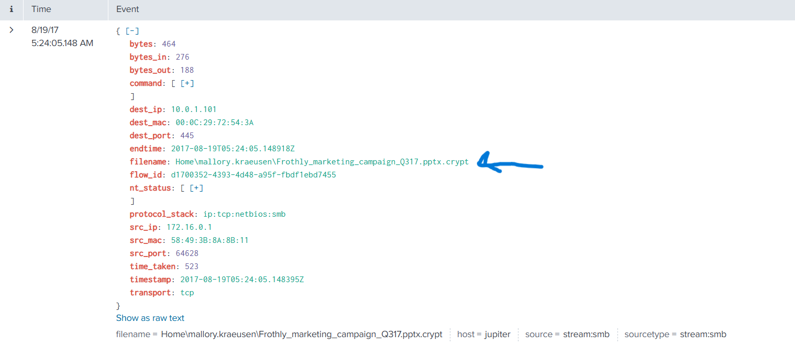 

Answer: `Frothly_marketing_campaign_Q317.pptx.crypt` 

### Q2: There is a Games of Thrones movie file that was encrypted as well. What season and episode is it?  

Since you don't know the file extension, you can't use the same approach as before.  

you need to search for all encrypted files. 

- index="botsv2"  host="MACLORY-AIR13" .crypt

 

Answer: `S07E02` 

### Q3: Kevin Lagerfield used a USB drive to move malware onto kutekitten, Mallory's personal MacBook. She ran the malware, which obfuscates itself during execution. Provide the vendor name of the USB drive Kevin likely used. Answer Guidance: Use time correlation to identify the USB drive.

 use the next query 
 - index="botsv2"  kutekitten usb

by going down you will find 

 

google it 

 

Answer: `Alcor Micro Corp.`

### Q4: What programming language is at least part of the malware from the question above written in?

using the last query from previouse question you will find the username when event occur 

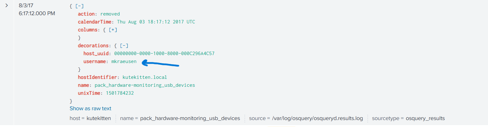  

now you need to know more about maliciuose file 

- index="botsv2" kutekitten mkraeusen

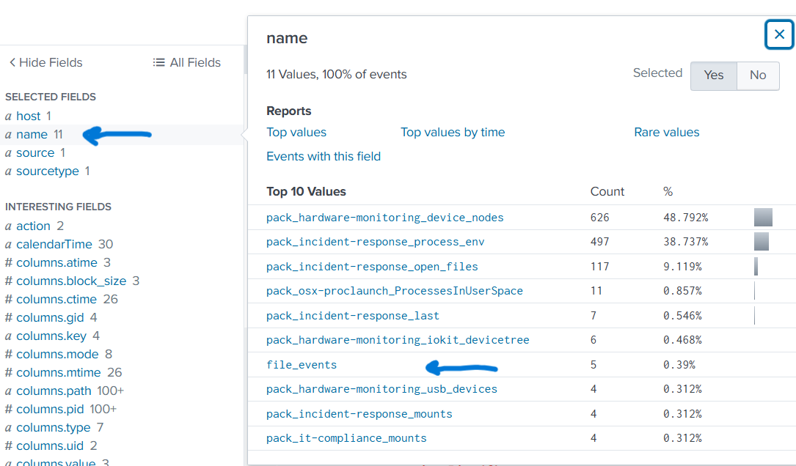  

include it in your query 

- index="botsv2" kutekitten mkraeusen name=file_events

now you found the hash value of the malicious file 

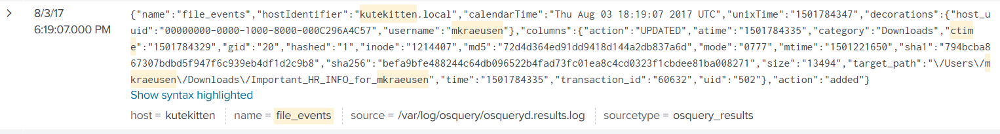  

analyze it using [Virus total](https://www.virustotal.com)

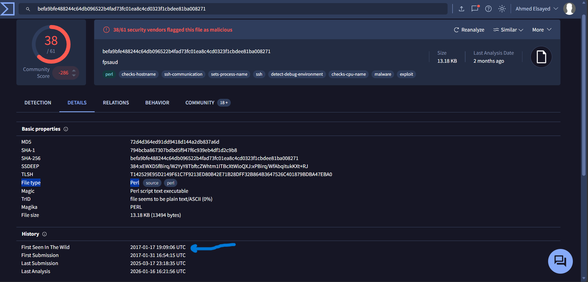  

as you see above the file is marked as malicious 

Answer: `perl`

### Q5: When was this malware first seen in the wild? Answer Guidance: YYYY-MM-DD

from the same photo above you can find it 

Answer: `2017-01-17 19:09:06`

### Q6: The malware infecting kutekitten uses dynamic DNS destinations to communicate with two C&C servers shortly after installation. What is the fully-qualified domain name (FQDN) of the first (alphabetically) of these destinations? 

form virus total in the relation tab you will find the next 

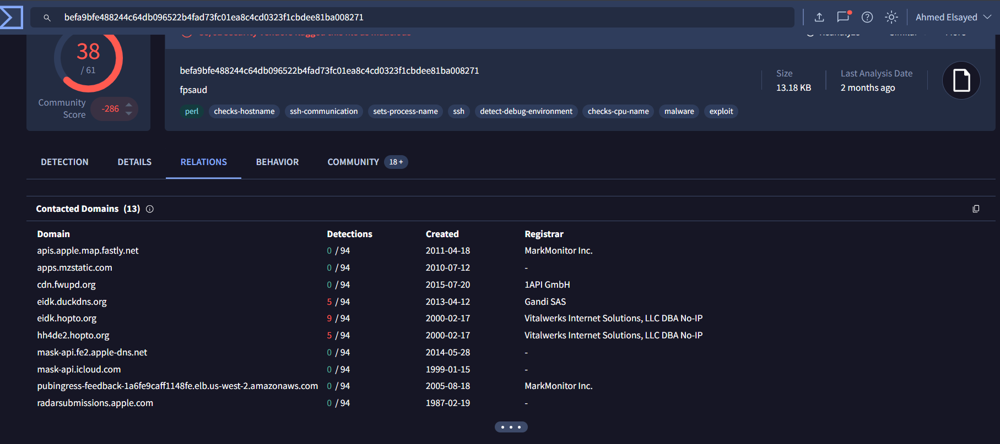  

Answer: `eidk.duckdns.org`

### Q7: From the question above, what is the fully-qualified domain name (FQDN) of the second (alphabetically) contacted C&C server?

the answer is in the photo above 

Answer: `eidk.hopto.org`

# 400 series questions

### Q1: A Federal law enforcement agency reports that Taedonggang often spear phishes its victims with zip files that have to be opened with a password. What is the name of the attachment sent to Frothly by a malicious Taedonggang actor?

because of it's a spear phishing attack, it's mostly via email so we will use sourcetype=stream:smtp 

- index="botsv2"  source="stream:smtp" .zip

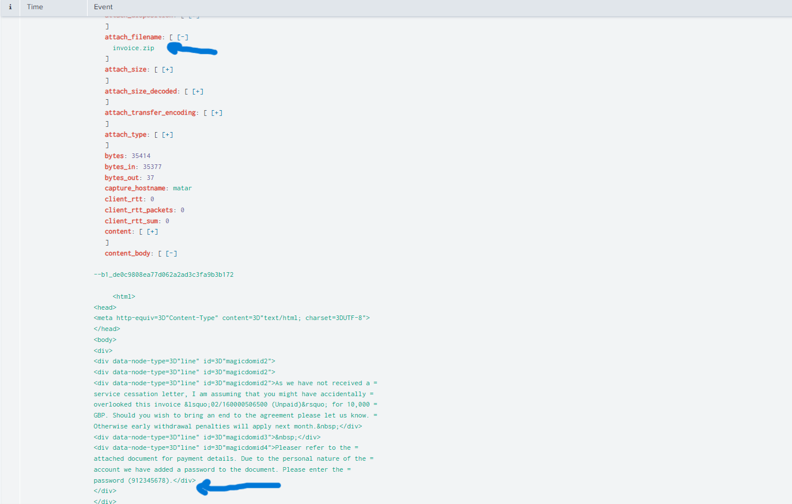  

Answer: `invoice.zip`

### Q2: What is the password to open the zip file?

with the same query above you can find the password 

Answer: `912345678`

### Q3: The Taedonggang APT group encrypts most of their traffic with SSL. What is the "SSL Issuer" that they use for the majority of their traffic? Answer guidance: Copy the field exactly, including spaces.

remember the attacker ip from `Q3 in 200 series` = `45.77.65.211` 

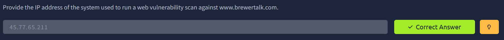  

so we will include it in our query 

- index="botsv2" 45.77.65.211 ssl

search on the fields for ssl_issuer 

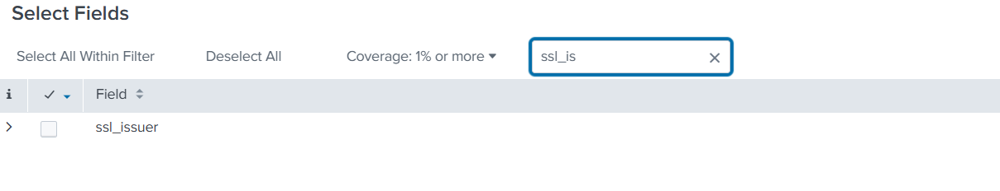

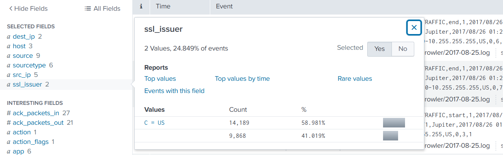

Answer: `C = US`

### Q4: What unusual file (for an American company) does winsys32.dll cause to be downloaded into the Frothly environment?

- index="botsv2"  winsys32.dll
by using this query i found that ftp connection start and take its command from winsys32.dll

so we will switch stream  to ftp 

- index="botsv2" sourcetype=stream:ftp RETR

the RETR method in FTP means retrieve which means download from ftp server, so we will include it in our query 

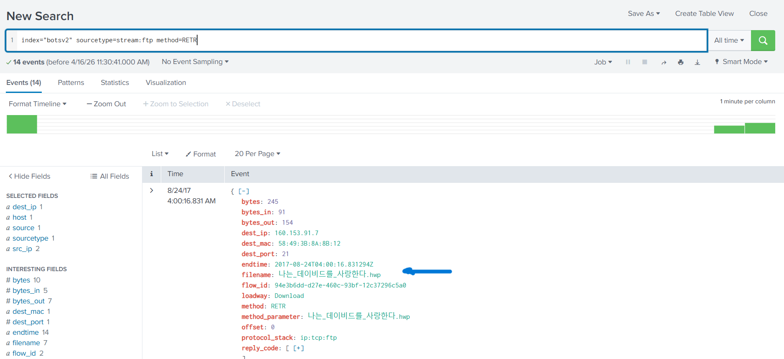

Answer: `나는_데이비드를_사랑한다.hwp`

### Q5: What is the first and last name of the poor innocent sap who was implicated in the metadata of the file that executed PowerShell Empire on the first victim's workstation? Answer example: John Smith

the task provide some useful links, you can examine any of them and search for the answers in metadata 

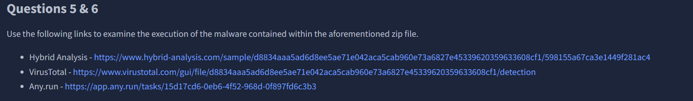

[VT](https://www.virustotal.com/gui/file/d8834aaa5ad6d8ee5ae71e042aca5cab960e73a6827e45339620359633608cf1/detection) 

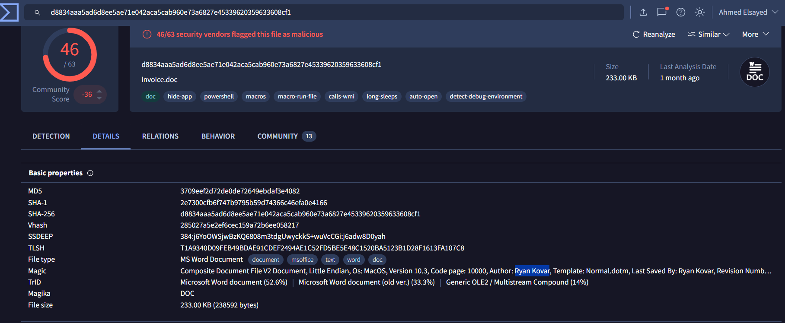

Answer: `Ryan Kovar`

### Q6: Within the document, what kind of points is mentioned if you found the text?

by user the [AnyRun](https://app.any.run/tasks/15d17cd6-0eb6-4f52-968d-0f897fd6c3b3) to dynamic analysis

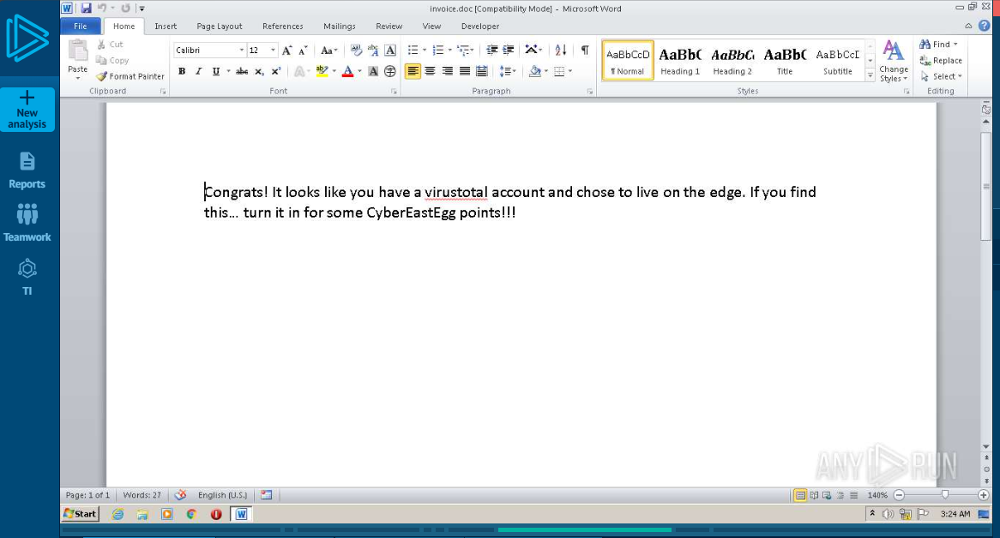

Answer: `CyberEastEgg`

### Q7: To maintain persistence in the Frothly network, Taedonggang APT configured several Scheduled Tasks to beacon back to their C2 server. What single webpage is most contacted by these Scheduled Tasks? Answer example: index.php or images.html

- index="botsv2" schtasks.exe  sourcetype=wineventlog create

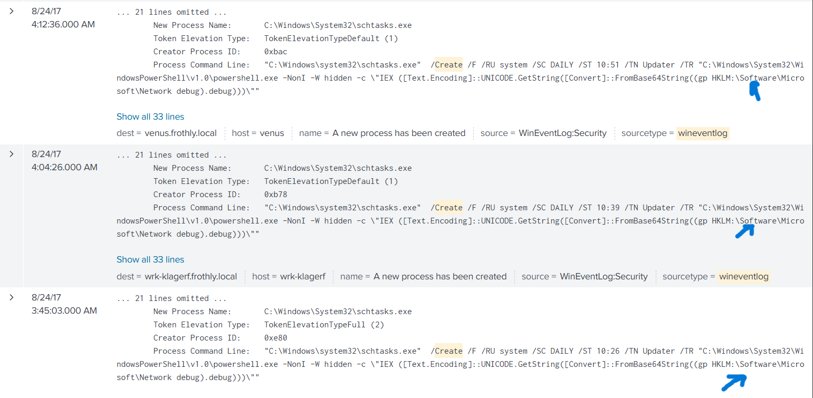

gp = Get-ItemProperty which take value from debug key

- index="botsv2 HKLM:\\Software\\Microsoft\\Network

you will see the data section is encoded using base64 

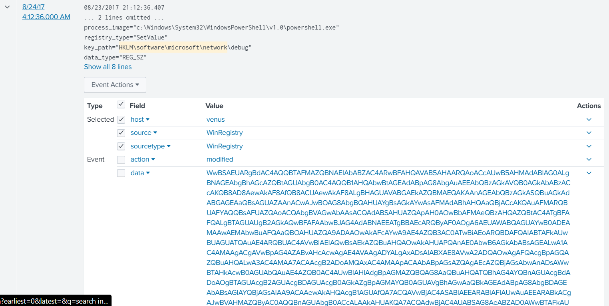

you can decode it using [cyberchef](https://cyberchef.org/)

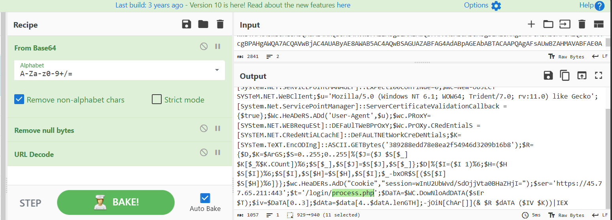

Answer: `process.php`

## The End 
# I hope you find it useful.

  

  

