# Splunk 2 aka Boss of the SOC 
# 100 series questions
## scenario 
### Question 1: Identify the competitor website

The objective is to determine the competitor website visited by Amber by analyzing network traffic logs.

#### Step 1: Identify Amber's IP address

 we focus on PAN traffic logs to extract her IP address:

- index="botsv2" sourcetype="pan:traffic" amber

you will find the  `src_ip: 10.0.2.101`

#### Step 2: Analyze HTTP traffic

After identifying Amber's IP address, we analyze her web activity:

- index="botsv2" IPADDR sourcetype="stream:HTTP"

you can navigate to  `http_referrer` to see all visited websites 

#### Step 3: Extract visited websites

To narrow down the results and focus on websites:

- index="botsv2" IPADDR sourcetype="stream:HTTP" |dedup site |table site

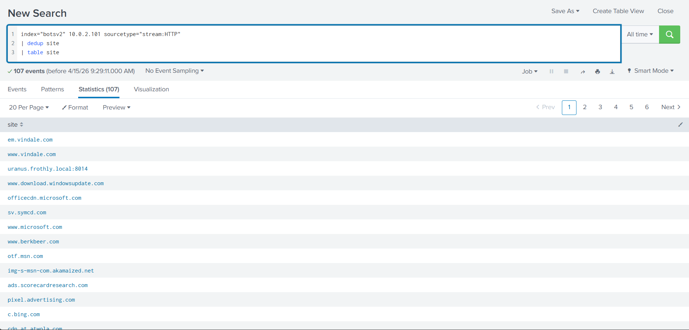 

#### Q1: Amber Turing was hoping for Frothly to be acquired by a potential competitor which fell through, but visited their website to find contact information for their executive team. What is the website domain that she visited?

Through a Google search, I found that Frothly is a brewing supplies company.

The domain `www.berkbeer.com` was identified as the competitor website, as it belongs to the same industry (beer/beverage) as Frothly.

Answer: `www.berkbeer.com`

### Question 2-7 

After identifying the competitor website, we focused on Amber’s HTTP traffic to that domain:

- index="botsv2" IPADDR sourcetype="stream:HTTP" COMPETITOR_WEBSITE

This helped identify the image accessed by Amber.

Next, we analyzed SMTP traffic to retrieve Amber’s email address and investigate communication with the competitor:

- index="botsv2" sourcetype="stream:smtp" AMBERS_EMAIL COMPETITOR_WEBSITE

This allowed us to identify email exchanges and extract additional details such as the CEO’s full name.

#### Q2: Amber found the executive contact information and sent him an email. What image file displayed the executive's contact information? Answer example: /path/image.ext

you can you this query 
- index="botsv2" 10.0.2.101 sourcetype="stream:HTTP" "www.berkbeer.com" 
| table uri_path 
| dedup uri_path

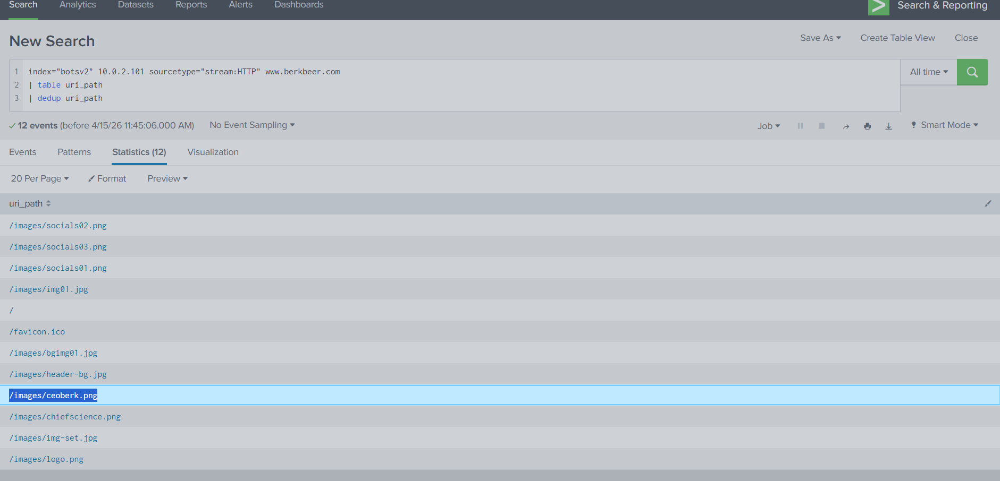 

Answer: `/images/ceoberk.png`

#### Q3: What is the CEO's name? Provide the first and last name.

by using this query 
- index="botsv2" smtp
                    
by the way, SMTP protocol is Simple Mail Transfer Protocol which is related to mails 
  you will find amber mail `aturing@froth.ly`
  
use this - index="botsv2" smtp  "aturing@froth.ly" ceo
then click `show as raw text` to show all info 
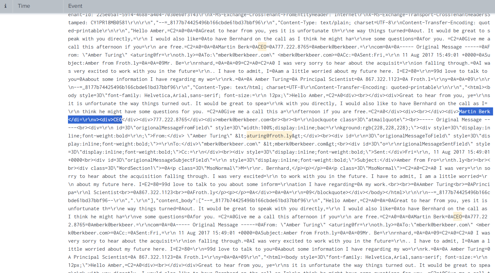
Answer: `Martin Berk`

#### Q4: What is the CEO's email address?

with the same query above you can find sender_email: "mberk@berkbeer.com"

Answer: `mberk@berkbeer.com`

#### Q5: After the initial contact with the CEO, Amber contacted another employee at this competitor. What is that employee's email address?
- index="botsv2" smtp  aturing@froth.ly berkbeer
  
you will find another email address from the same company
  
  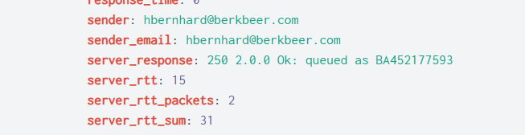
  
  Answer : `hbernhard@berkbeer.com`

#### Q6: What is the name of the file attachment that Amber sent to a contact at the competitor?
- index="botsv2" smtp  "aturing@froth.ly" berkbeer

Answer: `Saccharomyces_cerevisiae_patent.docx`

#### Q7: What is Amber's personal email address?
by invistigate the same event from above question, you will find the content-type is base64 decode 

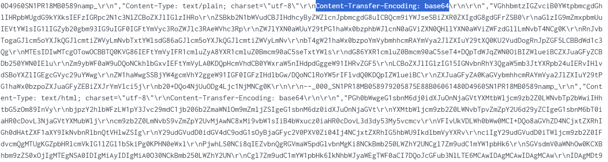

 use [cyberchef](https://cyberchef.org) to decode 
 
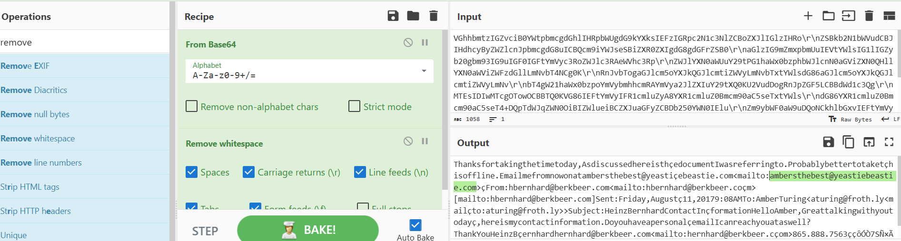

Answer: `ambersthebest@yeastiebeastie.com`

# 200 series questions
#### Q1: What version of TOR Browser did Amber install to obfuscate her web browsing? Answer guidance: Numeric with one or more delimiter.

use can search using - index="botsv2" amber tor install 

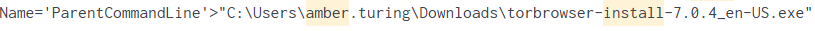

Answer: `index="botsv2" amber tor install`

#### Q2: What is the public IPv4 address of the server running www.brewertalk.com? 

 - index="botsv2"  "www.brewertalk.com" | table host_addr{} |dedup host_addr{}
the host address is ip related to specific host

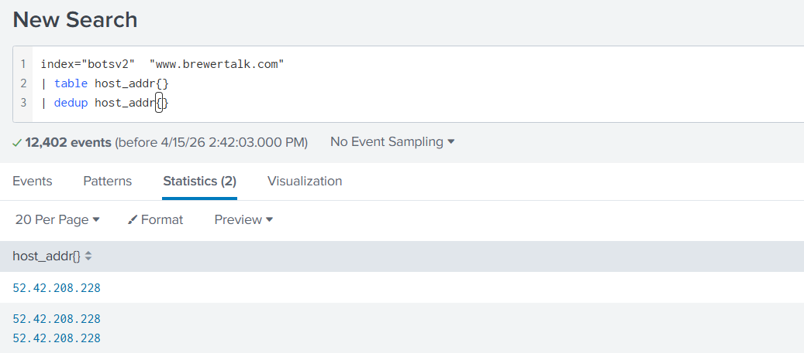

OR you can find it by search for dest_ip 

- index="botsv2" source="stream:http" "www.brewertalk.com"| stats count by dest_ip

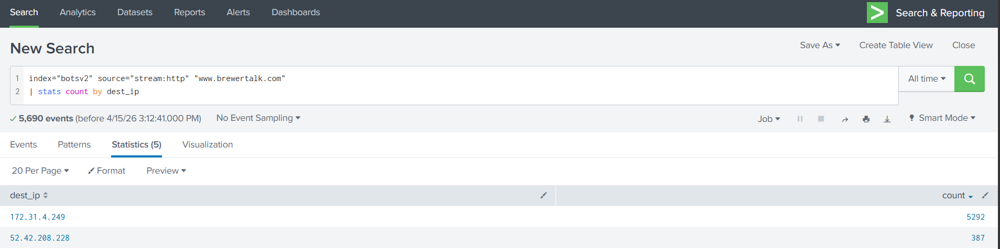 

Answer: `52.42.208.228`

#### Q3: Provide the IP address of the system used to run a web vulnerability scan against www.brewertalk.com?

- index="botsv2" source="stream:http" "www.brewertalk.com" | stats count by src_ip

using the hint "which ip is hitting the hardest"

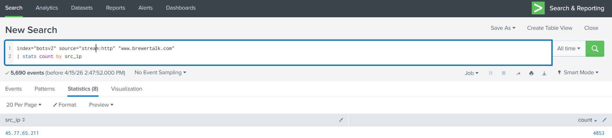 

Answer: `45.77.65.211`

#### Q4: The IP address from Q#2 is also being used by a likely different piece of software to attack a URI path. What is the URI path? Answer guidance: Include the leading forward slash in your answer. Do not include the query string or other parts of the URI. Answer example: /phpinfo.ph  
we have the public ip and private ip form previose questions 
- index="botsv2"  dest_ip="172.31.4.249" OR  dest_ip="52.42.208.228" | stats count by uri_path
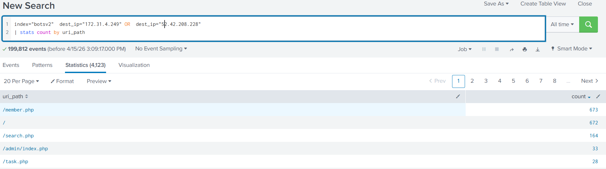 

To be absolutely sure we will see the full event related to /member.php 
- index="botsv2"  source="stream:http" /member.php

  there is an sql  injection query
  
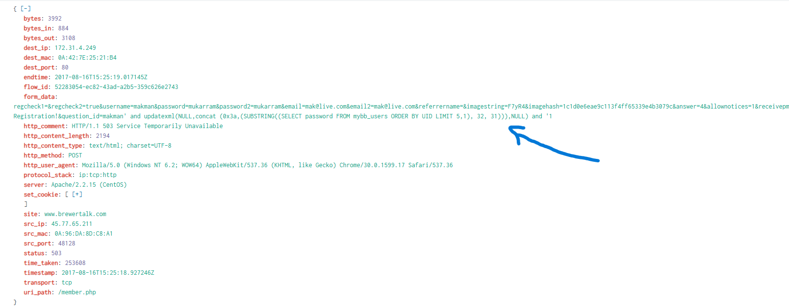 

Answer: `/member.php`

#### Q5: What SQL function is being abused on the URI path from the previous question?

using the same query above 
- index="botsv2"  source="stream:http" /member.php
you will find SQL function

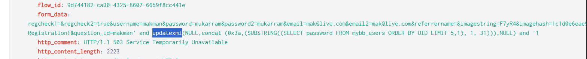 

Answer: `updatexml` 

#### Q6: What was the value of the cookie that Kevin's browser transmitted to the malicious URL as part of an XSS attack? 

use this query - index="botsv2"  sourcetype="stream:http"  Kevin

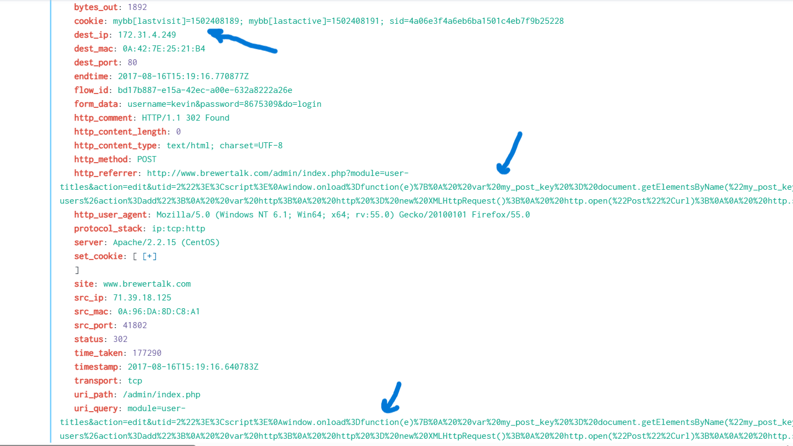 

by decode URL you find that `uri_query` and `http_referrer` include <script> which refer to XSS 

Answer: `1502408189` 

#### Q7: What brewertalk.com username was maliciously created by a spear phishing attack? 
using the same query above you will find  

the attacke stole Kevien's CSRF token 

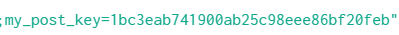

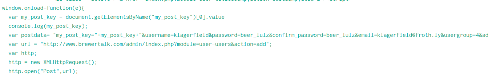

Answer: `kIagerfield`

  

