# Splunk 3 aka Boss of the SOC writeup 
### lab Link [Splunk 3](https://tryhackme.com/room/splunk3zs)

# TASK 3

### Q1: List out the IAM users that accessed an AWS service (successfully or unsuccessfully) in Frothly's AWS environment? Answer guidance: Comma separated without spaces, in alphabetical order. (Example: ajackson,mjones,tmiller)

firstly, I used the command givent in the task 2 to list all sourcetype available
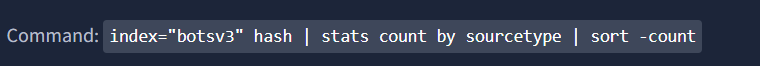

one of them are related to AWS
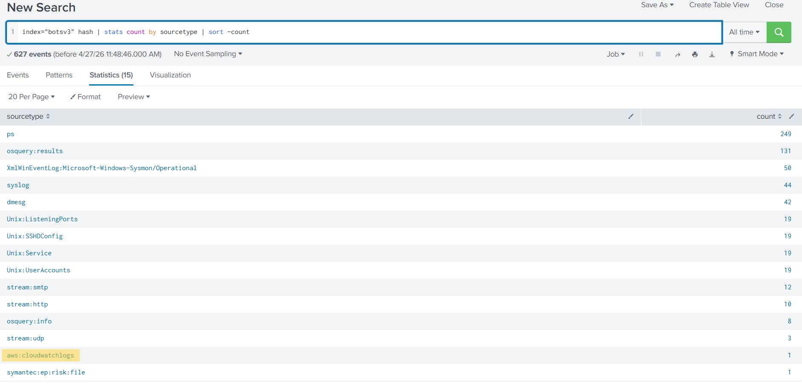

then I used this query 
  - index="botsv3" sourcetype = aws* | stats count by user

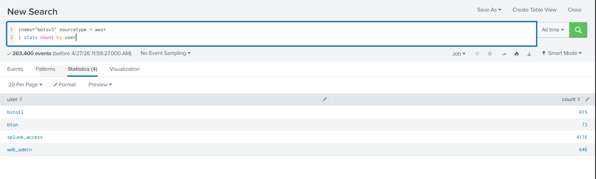

Answer: `bstoll,btun,splunk_access,web_admin`

### Q2: What field would you use to alert that AWS API activity has occurred without MFA (multi-factor authentication)? Answer guidance: Provide the full JSON path. (Example: iceCream.flavors.traditional)

in the link given in the Q1 [AWS](https://docs.aws.amazon.com/awscloudtrail/latest/userguide/cloudtrail-log-file-examples.html)

I found that 

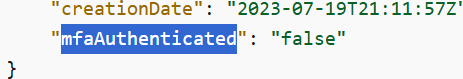

by using this query 
   - index="botsv3" sourcetype = aws*  mfaAuthenticated

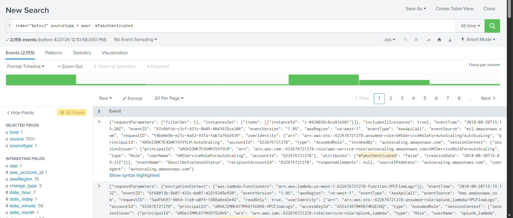

by searching on fields for mfa you can find that

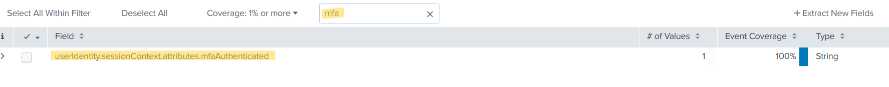

Answer: `userIdentity.sessionContext.attributes.mfaAuthenticated`

### Q3: What is the processor number used on the web servers? Answer guidance: Include any special characters/punctuation. (Example: The processor number for Intel Core i7-8650U is i7-8650U.)

return back to the command from task 2 to list all sourcetypes
 - index="botsv3" hash | stats count by sourcetype | sort -count

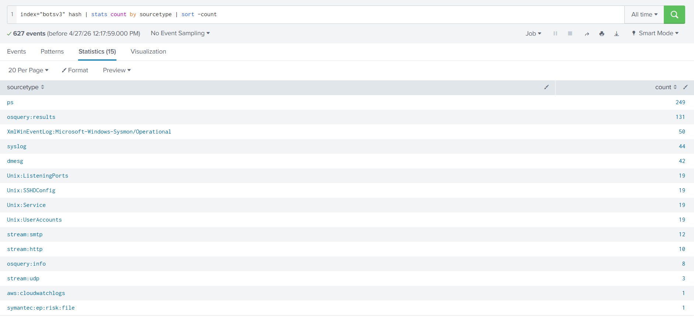

the `dmesg` is related to `kernel logs` which can be related to `Hard Ware` component 
so, I used it as a source type and search for CPU
  - index="botsv3" sourcetype = dmesg CPU

and found that 

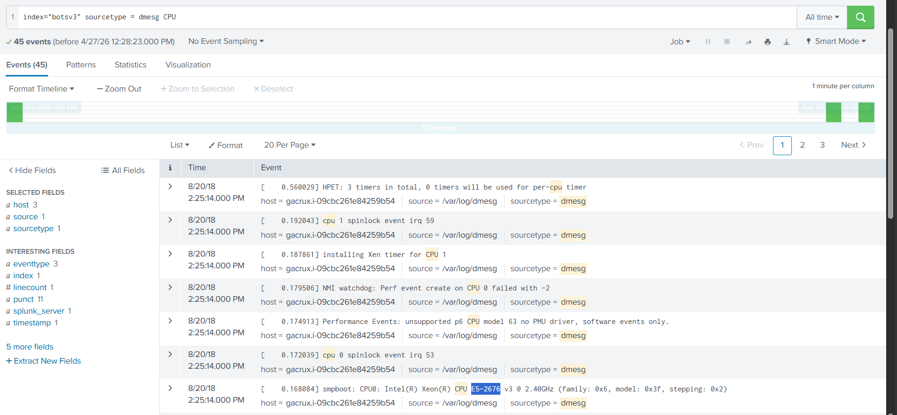

Answer: `E5-2676`

### Q4: Bud accidentally makes an S3 bucket publicly accessible. What is the event ID of the API call that enabled public access? Answer guidance: Include any special characters/punctuation.

`S3 : is a bucket in Amazon Web Services is a cloud storage container used to store and manage files like images, logs, and backups.`

by using this query be cause of the given link 
  - index="botsv3" sourcetype = aws*  PutBucketAcl

I found 2 events, by analyze both I found that 

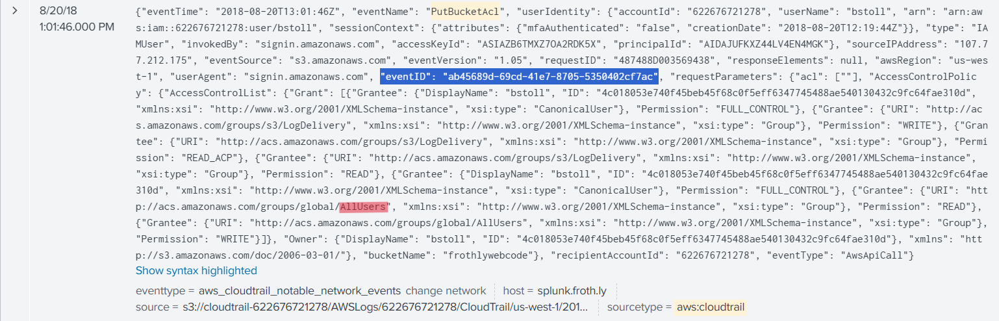

Answer: `ab45689d-69cd-41e7-8705-5350402cf7ac`

### Q5: What is Bud's username?

from the same event in the previous question click show raw text

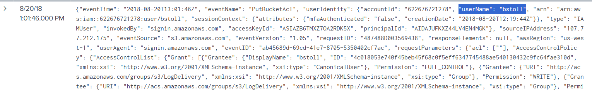

Answer: `bstoll`

### Q6: What is the name of the S3 bucket that was made publicly accessible?

also you can find the answer from the same event 

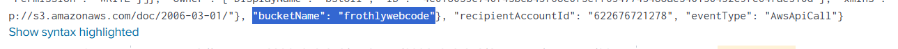

Answer: `frothlywebcode`

### Q7: What is the name of the text file that was successfully uploaded into the S3 bucket while it was publicly accessible? Answer guidance: Provide just the file name and extension, not the full path. (Example: filename.docx instead of /mylogs/web/filename.docx)

in source type I found that there was one related to `s3`

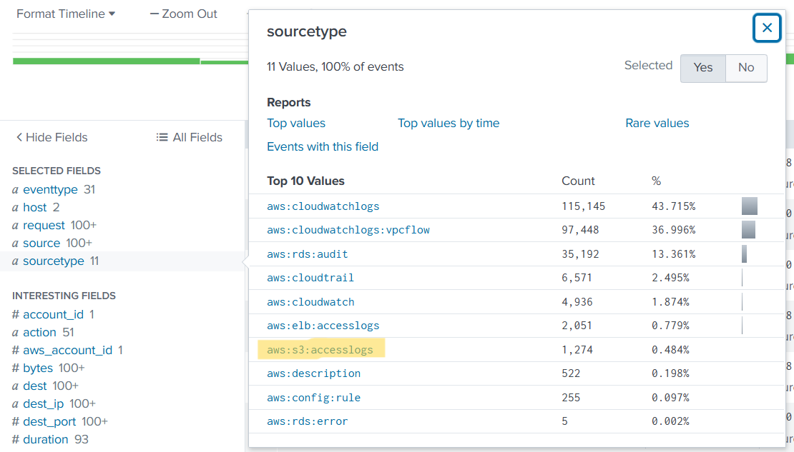

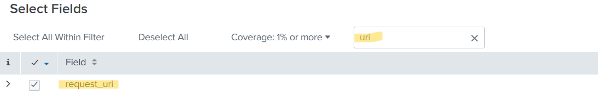

so, I filtered using this sourcetype and bucket name found in the previous question, 
(PUT OR POST ) because file is uploaded and stats by uri to show only uri
 - index="botsv3" sourcetype="aws:s3:accesslogs" bucket_name=frothlywebcode  (PUT OR POST) | stats count by request_uri

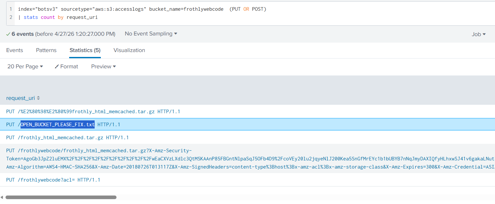

Answer: `OPEN_BUCKET_PLEASE_FIX.txt`

### Q8: What is the FQDN of the endpoint that is running a different Windows operating system edition than the others?

Firstly, I 
`winhostmon is a data source that collects monitoring information from Windows hosts, such as processes, services, and system activity.`

