# Volt Typhoon Writeup
### Lab Link [Volt Typhoon](https://tryhackme.com/room/volttyphoon)
## Scenario
```
The SOC has detected suspicious activity indicative of an advanced persistent threat (APT) group known as Volt Typhoon, notorious for targeting high-value organizations. Assume the role of a security analyst and investigate the intrusion by retracing the attacker's steps.

You have been provided with various log types from a two-week time frame during which the suspected attack occurred. Your ability to research the suspected APT and understand how they maneuver through targeted networks will prove to be just as important as your Splunk skills. 
```

## Task 2 : Initial Access
```
Volt Typhoon often gains initial access to target networks by exploiting vulnerabilities in enterprise software.
In recent incidents, Volt Typhoon has been observed leveraging vulnerabilities in Zoho ManageEngine ADSelfService Plus,
a popular self-service password management solution used by organizations.
```
### Q1: Comb through the ADSelfService Plus logs to begin retracing the attacker’s steps. At what time (ISO 8601 format) was Dean's password changed and their account taken over by the attacker?

Firstly, I used this query to know which index contains data
- | eventcount summarize=false index=*

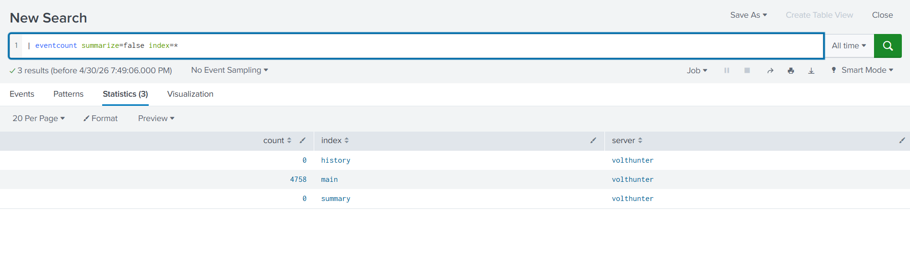

From this field I choosed user name = dean 
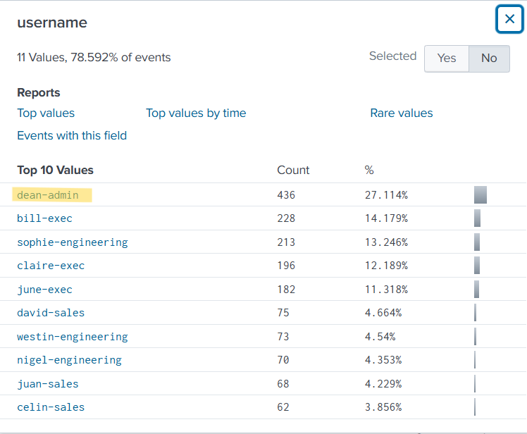

then from this filed I choosed password change 

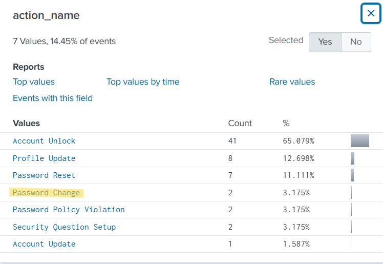

if you can't see the field click All field then search using field name 
the final query 
- index = main username="dean-admin" action_name="Password Change"

you will see these two events 

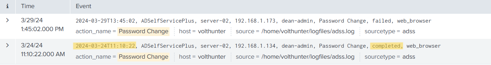

choose the time of the completed action no failed 

Answer: `2024-03-24T11:10:22`


### Q2: Shortly after Dean's account was compromised, the attacker created a new administrator account. What is the name of the new account that was created?

I filtered by time after the time in Q1 
click on the time then choose *after this time*

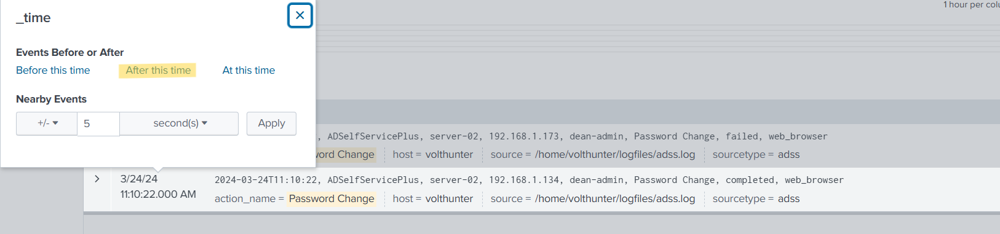

then from action_name field choose Enrollment 

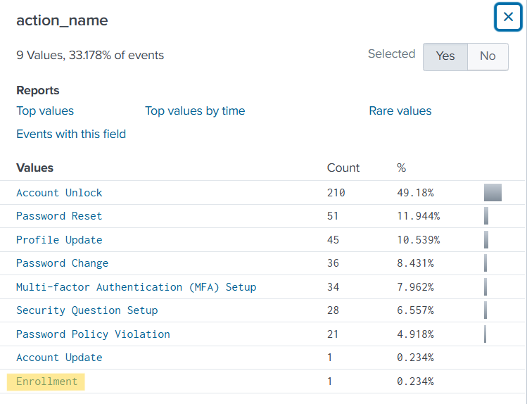

you will see the answer

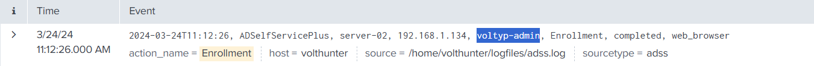


Answer: `voltyp-admin`


## Task 3 : Execution
```
Volt Typhoon is known to exploit Windows Management Instrumentation Command-line (WMIC) for a range of execution techniques.
They leverage WMIC for tasks such as gathering information and dumping valuable databases,
allowing them to infiltrate and exploit target networks. By using "living off the land" binaries (LOLBins),
they blend in with legitimate system activity, making detection more challenging.
```
### Q1: In an information gathering attempt, what command does the attacker run to find information about local drives on server01 & server02?

search using this query 
- index = main server01 server02

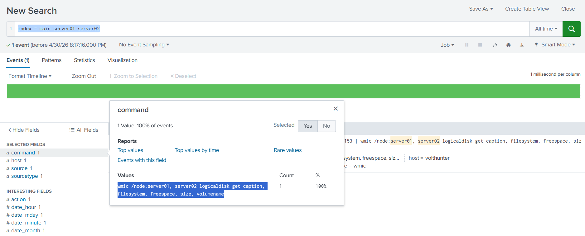

Answer: `wmic /node:server01, server02 logicaldisk get caption, filesystem, freespace, size, volumename`


### Q2: The attacker uses ntdsutil to create a copy of the AD database. After moving the file to a web server, the attacker compresses the database. What password does the attacker set on the archive?

first of all, I filtered by ntdsutil
- index = main ntdsutil
and found that
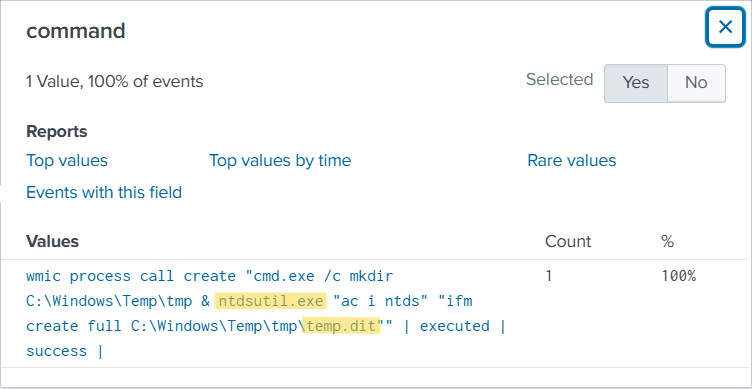

the attacker create a copy of the AD database *temp.dit* to file named *cisco-up.7z* 

then I searched using *temp.dit* to see What password does the attacker set on the archive which used to compresse DB
- index = main temp.dit
    OR you can search using
 - index = main cisco-up.7z
  

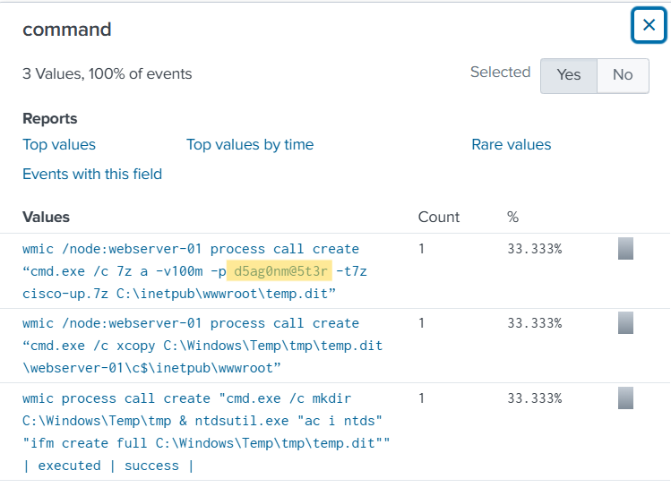


Answer: `d5ag0nm@5t3r`


## Task 4 : Persistence
```
Our target APT frequently employs web shells as a persistence mechanism to maintain a foothold. They disguise these web shells as legitimate files, enabling remote control over the server and allowing them to execute commands undetected.
```

### Q1: To establish persistence on the compromised server, the attacker created a web shell using base64 encoded text. In which directory was the web shell placed?

for this, I went through commandlines excuted on the machine 
- index = main | stats count by CommandLine

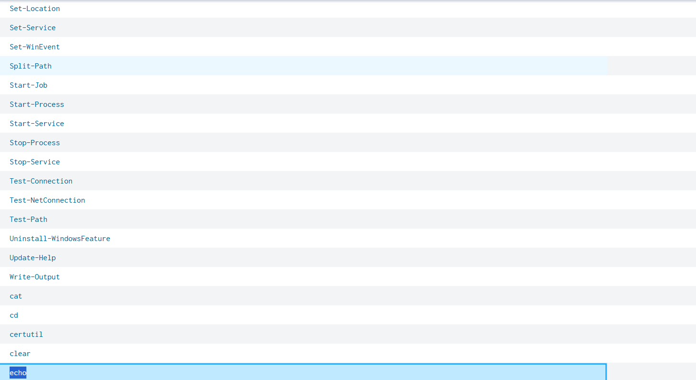

The most suspicious command is echo, as the other commands appear to be for reconnaissance, 
while attackers commonly use echo to write Base64-encoded payloads into a file.

so, I clicked on view event to further investiagte 

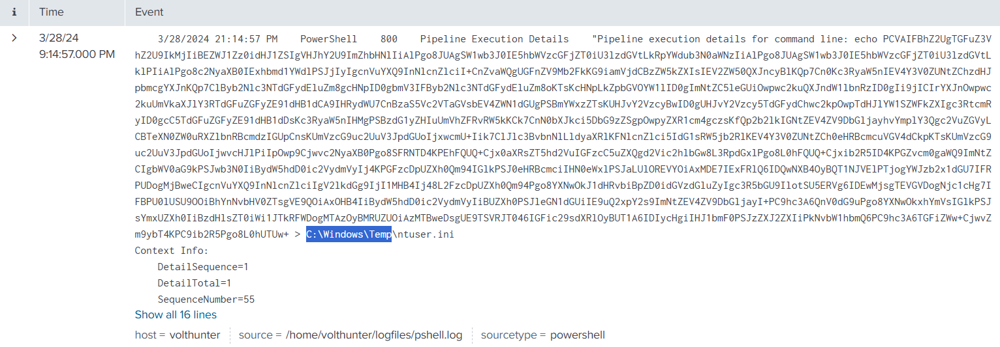 

the photo above clearify that the attacker save base64 in a file named *C:\Windows\Temp\ntuser.ini*

to decode use [cyberchef](https://cyberchef.org/)

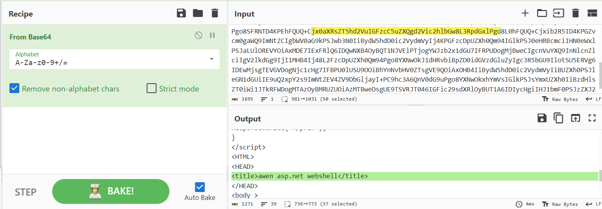 


Answer: `C:\Windows\Temp\` 


## Task 5 :Defense Evasion
```
Volt Typhoon utilizes advanced defense evasion techniques to significantly reduce the risk of detection.
These methods encompass regular file purging, eliminating logs, and conducting thorough reconnaissance of their operational environment.
```

### Q1: In an attempt to begin covering their tracks, the attackers remove evidence of the compromise. They first start by wiping RDP records. What PowerShell cmdlet does the attacker use to remove the “Most Recently Used” record?

I started my filter with powershell.exe and list all commands to investigate in
- index=main powershell.exe | stats count by CommandLine

and I found those 2 command which seemed suspicious 
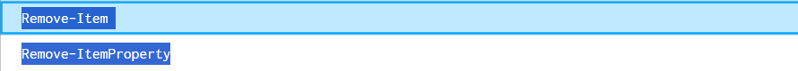 

after investigate in each of them by click view event to show events related to this command I found that 

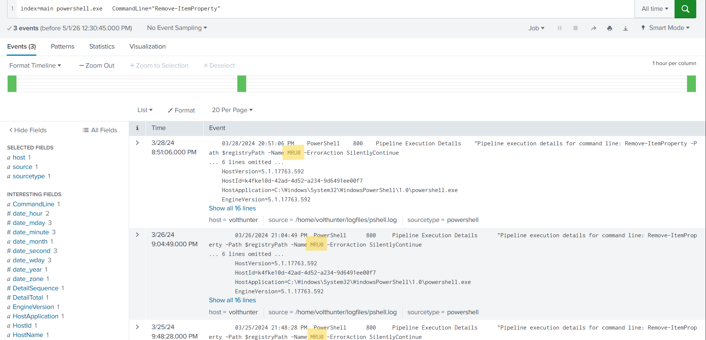 

the attacker remove MRU0 : Most Recently Used 

Answer: `Remove-ItemProperty`


### Q2: The APT continues to cover their tracks by renaming and changing the extension of the previously created archive. What is the file name (with extension) created by the attackers?

as we observe before, the archive name is *cisco-up.7z* copied from *temp.dit*

so, I searched using *cisco-up.7z* to see what commands excuted on
- index=main cisco-up.7z

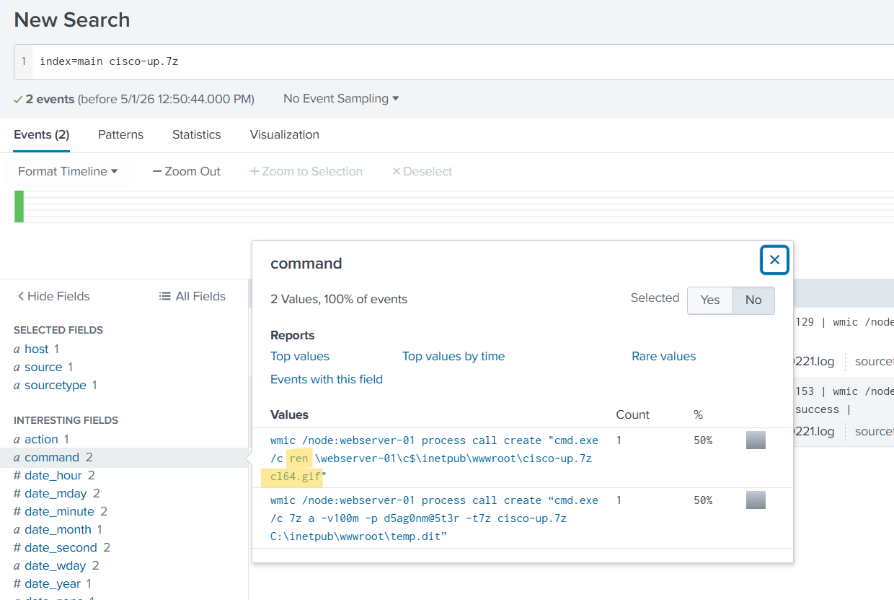 

Answer: `cl64.gif`

### Q3: Under what regedit path does the attacker check for evidence of a virtualized environment?
The attacker checks whether the system is a virtual machine to avoid detection, 
as it might be an analysis environment or a sandbox.

Attackers use commands like *Get-ItemProperty* or *reg query* to read registry values.

so, I filtered using them 

- index=main "Get-ItemProperty" OR "reg query"

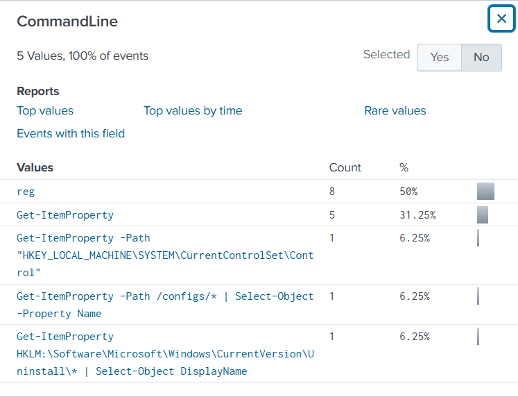 

By delving deeper, you can find that

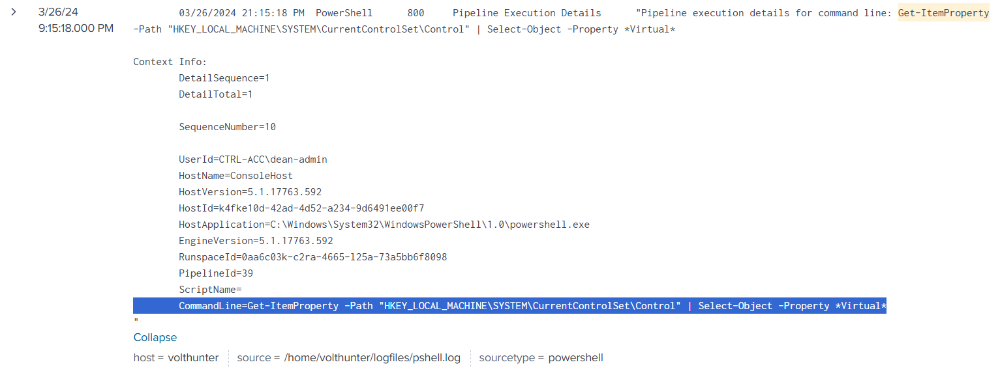 


Answer: `HKEY_LOCAL_MACHINE\SYSTEM\CurrentControlSet\Control`


## Task 6 : Credential Access
```
Volt Typhoon often combs through target networks to uncover and extract credentials from a range of programs.
Additionally, they are known to access hashed credentials directly from system memory.
```

### Q1: Using reg query, Volt Typhoon hunts for opportunities to find useful credentials. What three pieces of software do they investigate?
Answer Format: Alphabetical order separated by a comma and space.

by filtering using *reg query* 
- index=main  "reg query"
you will see 8 events, by invesitage them you can find the answer

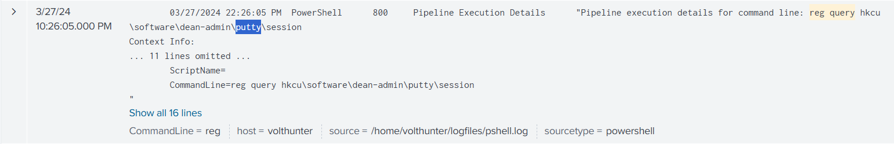 

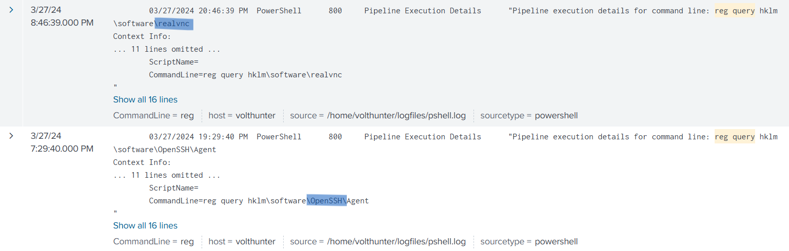 


Answer: `OpenSSH, putty, realvnc`

### Q2: What is the full decoded command the attacker uses to download and run mimikatz?

Answer: ``


## Task 7 : Discovery & Lateral Movement
```
Discovery
Volt Typhoon uses enumeration techniques to gather additional information about network architecture, logging mechanisms, successful logins, and software configurations, enhancing their understanding of the target environment for strategic purposes.

Lateral Movement
The APT has been observed moving previously created web shells to different servers as part of their lateral movement strategy.
This technique facilitates their ability to traverse through networks and maintain access across multiple systems.
```

### Q1: The attacker uses wevtutil, a log retrieval tool, to enumerate Windows logs. What event IDs does the attacker search for?
Answer Format: Increasing order separated by a space.

Answer: ``

### Q2: Moving laterally to server-02, the attacker copies over the original web shell. What is the name of the new web shell that was created?

Answer: ``


## Task 8 : Collection
```
During the collection phase, Volt Typhoon extracts various types of data,
such as local web browser information and valuable assets discovered within the target environment.
```

### Q1: The attacker is able to locate some valuable financial information during the collection phase. What three files does Volt Typhoon make copies of using PowerShell? Answer Format: Increasing order separated by a space.

Answer: ``

## Task 9 : C2 & Cleanup
```
C2
Volt Typhoon utilizes publicly available tools as well as compromised devices to establish discreet command and control (C2) channels.

Cleanup
To cover their tracks, the APT has been observed deleting event logs and selectively removing other traces and artifacts of their malicious activities.
```
### Q1: The attacker uses netsh to create a proxy for C2 communications. What connect address and port does the attacker use when setting up the proxy?
Answer Format: IP Port

Answer: ``

### Q2: To conceal their activities, what are the four types of event logs the attacker clears on the compromised system?

Answer: ``

## The End 
# I hope you find it useful.


